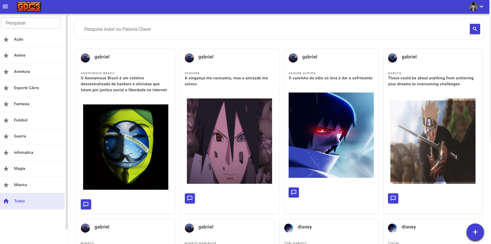
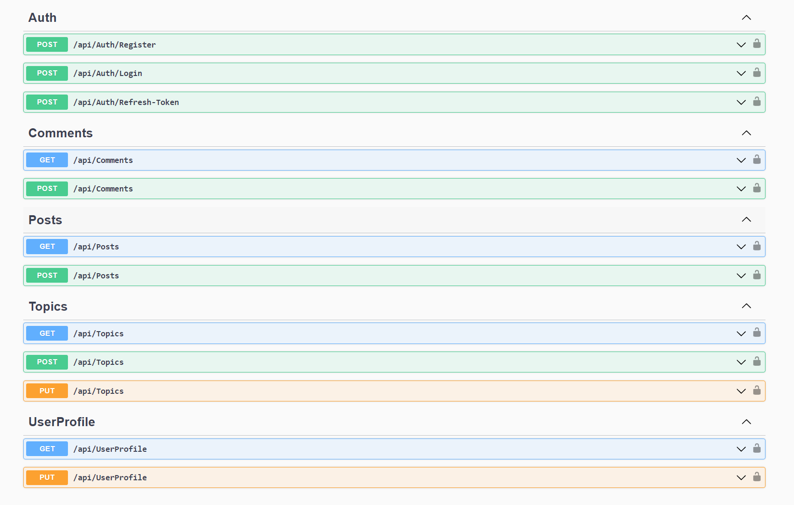
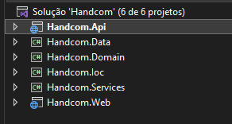
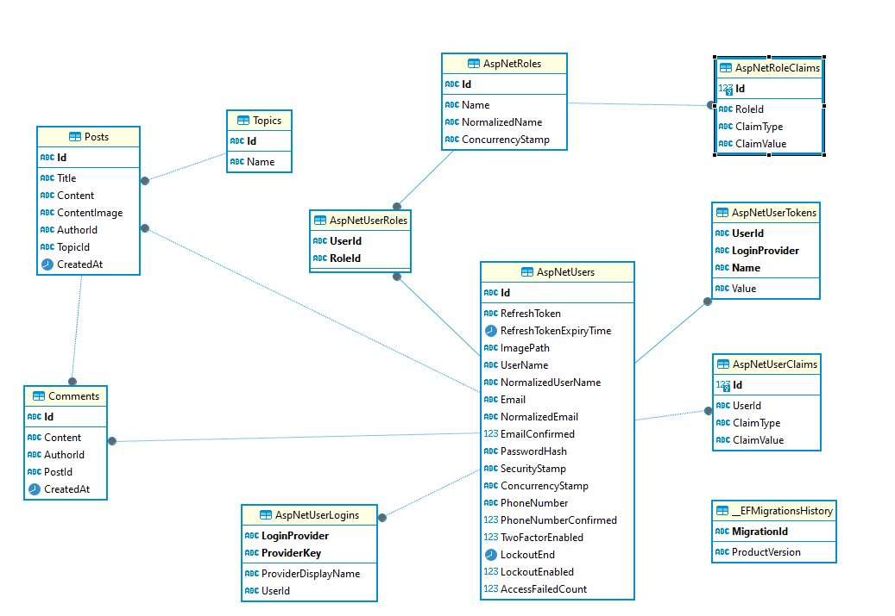

# Aplicação Blazor com Api .NET 8

Esta aplicação é desenvolvida com o poderoso framework Blazor WebAssembly, integrando a eficiente biblioteca Radzen para oferecer uma experiência de usuário rica e interativa. Construída sobre a versão mais recente do .NET 8, utilizamos o Entity Framework para uma manipulação de dados fluente e eficaz, juntamente com o Identity para garantir uma gestão de autenticação e autorização segura e confiável.

</br>

## Tela home 
---
</br>
<p align="center">
    
</p>

</br>

## Api 
---
</br>
<p align="center">
    
</p>


## Arquitetura:

### Arquitetura completa que implementa os aspectos mais importantes e utilizados, como:

- Clean Code
- Clean Architecture
- DDD - Domain Driven Design 
- Unit of Work
- Repository


---

## Visão geral da arquitetura

### Toda a aplicação é baseada em uma solução única com uma API e uma aplicação web Blazor
</br>
<p align="center">
    
</p>

---
## Banco de dados
Utilizamos o SQL Server 2019 como sistema de gerenciamento de banco de dados. Abaixo, apresentamos o esquema das tabelas utilizadas:

</br>

<p align="center">
    
</p>

</br>

---
## Iniciar projeto

Configure a string de conexão com o banco de dados SQL Server para garantir o acesso à sua base de dados.
</br>
Caminho Handcom.Api/appsettings.json

```
Server=localhost,1433;DataBase=Handcom_Database;User Id=sa;Password=SuaSenha;TrustServerCertificate=True;
```
</br>
Execute o comando a seguir para aplicar as migrações:

```
dotnet ef database update --project Handcom.Data  --startup-project Handcom.API
```